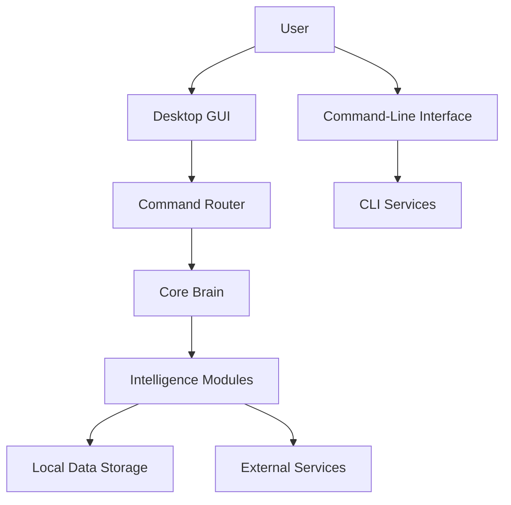

# JERVIS-X Architecture

JERVIS-X uses a modular Python architecture that separates the user interface, command routing, intelligence modules, data storage, and system services.

## System Flow

## Main Components

### Entry Point

`main.py` processes command-line options and launches the graphical application.

Supported options include:

- `--help`
- `--version`
- `--diagnostics`
- `--diagnostics-json`

### Graphical Interface

`gui/app.py` provides the CustomTkinter desktop interface, chat display, voice controls, system information, and user interaction.

### Command Router

`core/router.py` sends user commands to the central command-processing system.

### Core Brain

`core/brain.py` identifies commands and delegates work to the correct feature module. Unknown commands can use the configured AI fallback.

### Intelligence Modules

The `core/` package contains independent modules for features such as:

- Job application intelligence
- Calculations and engineering tools
- Notes, tasks, and reminders
- Weather and news
- Translation
- Security utilities
- System diagnostics
- Performance monitoring

### Data Storage

Runtime information is stored locally inside the `data/` directory. Exported reports are written to `exports/`. These runtime folders are excluded from Git.

### Windows Packaging

`scripts/build_windows.ps1` uses PyInstaller to create the Windows executable and ZIP package.

The GitHub Actions Windows workflow automatically:

1. Installs the application dependencies.
2. Builds the Windows executable.
3. Creates a ZIP archive and SHA-256 checksum.
4. Uploads build artifacts.
5. Publishes tagged GitHub releases.

## Quality and Security

JERVIS-X uses:

- Pytest automated testing
- Coverage enforcement
- GitHub Actions continuous integration
- CodeQL security scanning
- Dependabot dependency monitoring
- Packaged-runtime diagnostics